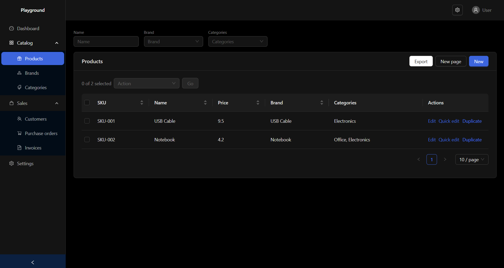
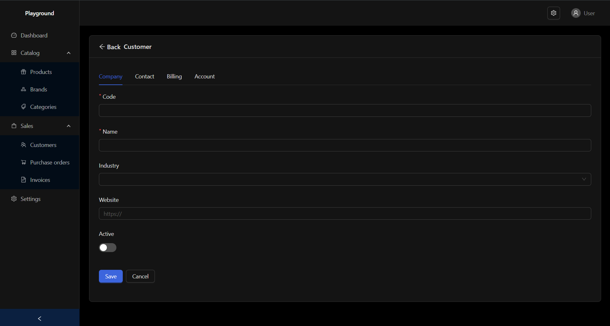
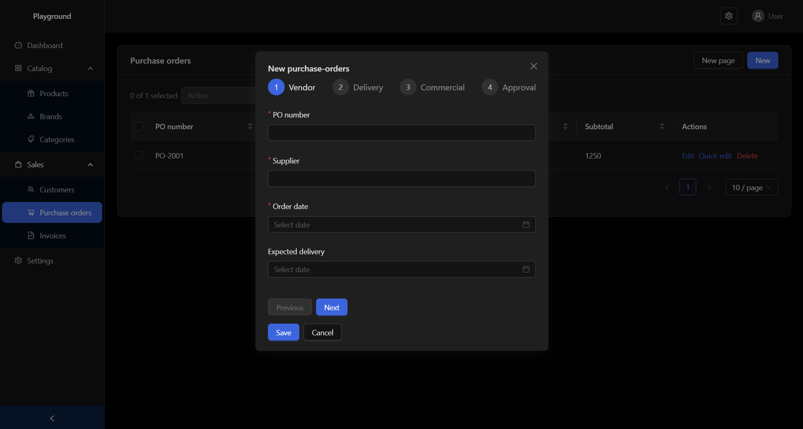
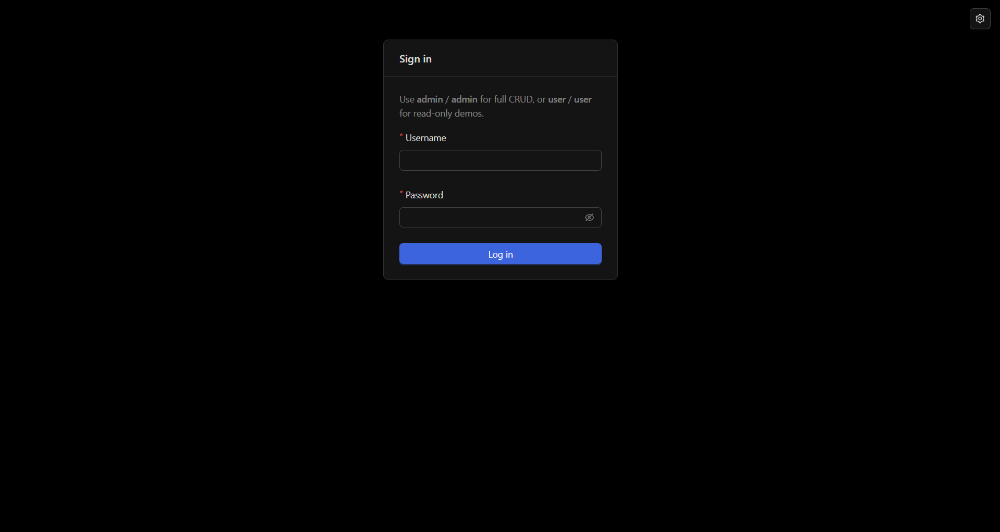
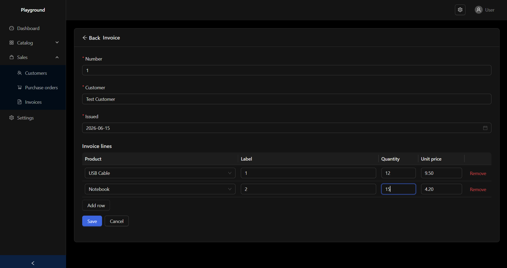

# ding-react-admin

**npm:** [`ding-react-admin`](https://www.npmjs.com/package/ding-react-admin)

## Live demo:
[playground on GitHub Pages](https://muhammadinaam.github.io/ding-react-admin/) (login: `admin` / `admin` or `user` / `user`)

## Tutorial:
[Build an admin app and add a Users page](docs/tutorial-one-entity.md) — step-by-step from `yarn create vite` through CRUD and routes.

```bash
yarn add ding-react-admin antd @ant-design/icons dayjs react-hook-form react-router-dom
```

Install details and peer versions: [docs/install.md](docs/install.md).

Composable admin shell for React apps: **Ant Design 6** layout, **CRUD field system** (lists, forms, filters, inlines, bulk actions), **theme/density** controls, **`AuthProvider`** + **`useAuth`**, **data / permissions providers** (react-admin–style naming, intentionally small), and **React Router** helpers.

## Screenshots

From the [playground demo](https://muhammadinaam.github.io/ding-react-admin/):

| List with filters | Tabbed form page |
| --- | --- |
|  |  |

| Stepped modal form | Login |
| --- | --- |
|  |  |

## Declarative CRUD

Wire a [`DataProvider`](docs/data-permissions.md) (see [Providers](#providers-manual-composition) below), then describe list and form pages in JSX — field `source` names map to your API. Filters, modals, permissions, and validation plug in when you need them; start with the basics:

### List page

```tsx
import { ResourceList, TextColumn, DateColumn } from "ding-react-admin";

export function InvoiceListPage() {
  return (
    <ResourceList resource="invoices" title="Invoices" pathPrefix="/invoices">
      <TextColumn source="number" label="Number" />
      <TextColumn source="customer" label="Customer" />
      <DateColumn source="issuedAt" label="Issued" />
    </ResourceList>
  );
}
```

Add `<TextFilter />`, `<ReferenceFilter />`, bulk actions, and row permissions inside the same component — [list pages guide](docs/crud/list-pages.md).

### Form page

```tsx
import { ResourceForm, TextField, DateField } from "ding-react-admin";

export function InvoiceFormPage() {
  return (
    <ResourceForm resource="invoices" title="Invoice" listPath="/invoices">
      <TextField source="number" label="Number" required />
      <TextField source="customer" label="Customer" required />
      <DateField source="issuedAt" label="Issued" required />
    </ResourceForm>
  );
}
```

Tabbed forms, stepped modals, and API error mapping — [forms guide](docs/crud/forms.md).

### Inline nested rows

Django-style tabular inlines: related rows edit in a table inside the parent form.



```tsx
import {
  InlineFormSet,
  NumberField,
  ResourceForm,
  TextField,
} from "ding-react-admin";

<ResourceForm
  resource="invoices"
  title="Invoice"
  listPath="/invoices"
  inlines={[{ resource: "invoice-lines", foreignKey: "invoiceId" }]}
>
  <TextField source="number" label="Number" required />
  <TextField source="customer" label="Customer" required />
  <InlineFormSet resource="invoice-lines" foreignKey="invoiceId" label="Lines">
    <TextField source="label" label="Label" required />
    <NumberField source="quantity" label="Qty" required min={0} />
    <NumberField source="unitPrice" label="Unit price" required min={0} step={0.01} />
  </InlineFormSet>
</ResourceForm>
```

Stacked layout, dependent fields, and validation — [inlines guide](docs/crud/inlines.md).

## Providers (manual composition)

Nothing is wired automatically except theme inside `<AdminApp />`. Wrap providers yourself:

| Provider | Required for |
|----------|----------------|
| **`AuthProvider`** | Login, logout, route guards (`Protected`, `GuestOnly`), `useAuth` |
| **`DataProvider`** | CRUD components (`ResourceList`, `ResourceForm`, …) |
| **`PermissionsProvider`** | Permission gating in CRUD (`usePermissions`, `useCan`) |

**Auth only** (custom pages, no CRUD yet):

```tsx
<AuthProvider adapter={createSessionStorageAuthAdapter()}>
  <AdminApp navItems={nav} routes={routes} />
</AuthProvider>
```

**Full stack** (CRUD + permissions) — see [docs/data-permissions.md](docs/data-permissions.md) and [`examples/playground/src/main.tsx`](examples/playground/src/main.tsx):

```tsx
<AuthProvider adapter={authAdapter}>
  <DataProvider value={dataProvider}>
    <PermissionsProvider can={permissions}>
      <AdminApp navItems={nav} routes={routes} />
    </PermissionsProvider>
  </DataProvider>
</AuthProvider>
```

Use **`createSessionStorageAuthAdapter`** for demos; replace with an adapter that calls your API in production. Implement **`AuthAdapter.login`** with a **`LoginCredentials`** object (`username`, `password`, plus any extra fields your login form needs, e.g. `businessId`).

## Getting started

**New to CRUD:** [docs/tutorial-one-entity.md](docs/tutorial-one-entity.md) — full walkthrough from `yarn create vite` through Users list/form, `data-provider.ts`, and routes.

**Quick path:** [docs/quick-start.md](docs/quick-start.md) — `<AuthProvider>` + `<AdminApp />` with declarative routes.

**Full control:** [docs/composition.md](docs/composition.md) and the [playground](examples/playground/src/main.tsx) — your own `createBrowserRouter` with `AdminLayout`, `Protected`, `GuestOnly`, `DataProvider`, and `PermissionsProvider`.

## Documentation

| Topic | Guide |
|-------|--------|
| Install & peer deps | [docs/install.md](docs/install.md) |
| **Tutorial: add one CRUD entity** | [docs/tutorial-one-entity.md](docs/tutorial-one-entity.md) |
| Example playground app | [docs/example-app.md](docs/example-app.md) |
| Sidebar navigation | [docs/navigation.md](docs/navigation.md) |
| CRUD overview | [docs/crud/overview.md](docs/crud/overview.md) |
| List pages & filters | [docs/crud/list-pages.md](docs/crud/list-pages.md) |
| **Bulk actions** (Django-style) | [docs/crud/bulk-actions.md](docs/crud/bulk-actions.md) |
| Form pages | [docs/crud/forms.md](docs/crud/forms.md) |
| Reference / lookup fields | [docs/crud/references.md](docs/crud/references.md) |
| Inline nested forms | [docs/crud/inlines.md](docs/crud/inlines.md) |
| Custom field types | [docs/crud/custom-fields.md](docs/crud/custom-fields.md) |
| Data layer & permissions | [docs/data-permissions.md](docs/data-permissions.md) |
| **Form validation errors** | [docs/form-validation-errors.md](docs/form-validation-errors.md) |
| **Routing & auth guards** | [docs/routing.md](docs/routing.md) |
| Login / register layout | [docs/auth-pages.md](docs/auth-pages.md) |
| Quick start (`<AdminApp />`) | [docs/quick-start.md](docs/quick-start.md) |
| Composition (your own router) | [docs/composition.md](docs/composition.md) |
| Odoo-style app hub | [docs/app-hub.md](docs/app-hub.md) |
| `createAdminRouter` shortcut | [docs/admin-router.md](docs/admin-router.md) |
| Developing next to your app (Vite) | [docs/developing.md](docs/developing.md) |

## License

MIT
